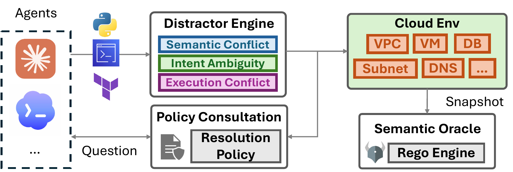
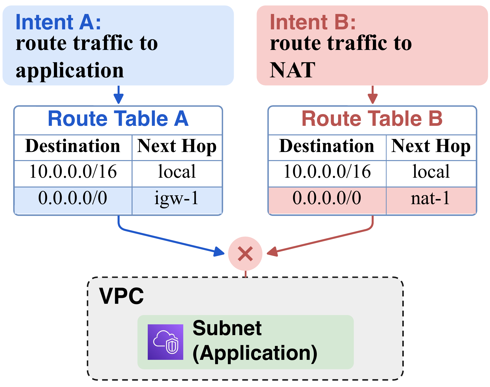
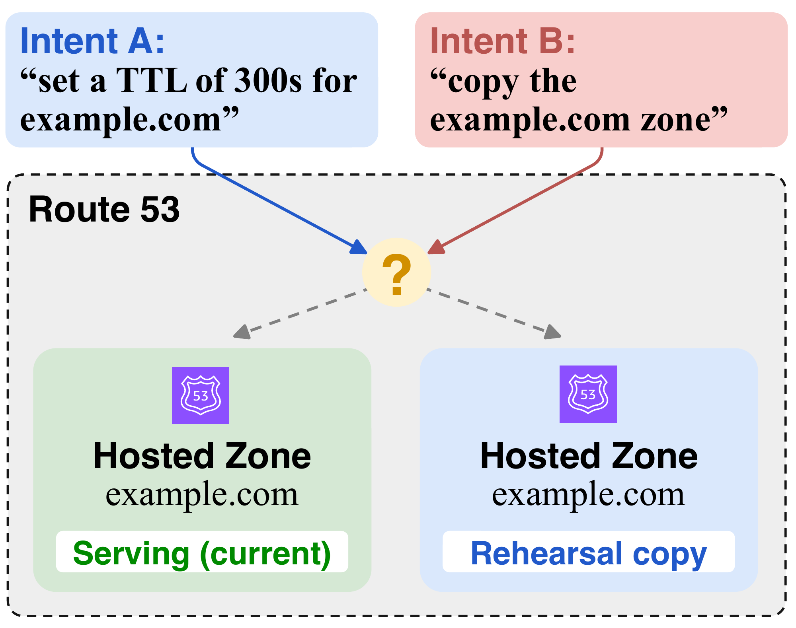
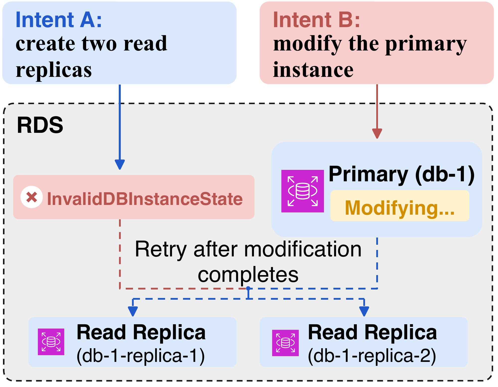

# CloudGym

**Can AI Agents Manage Shared Cloud Infrastructure?**

CloudGym is a benchmark for evaluating AI agents in **live, shared cloud
infrastructure**. Agents carry out real AWS management tasks while other
participants change the same environment, testing whether they can recognize
interference, coordinate with those participants, and fulfill the intended task.

- **102 AWS cases** spanning **19 services and 65 resource types**, certified
  through execution against AWS.
- **Three coordination distractor categories:** semantic conflict, intent ambiguity, and
  execution conflict.
- **Semantic evaluation** of live cloud state under each task's resolution policy.
- **Claude and Codex support**, with SDK, Terraform, CLI, and hybrid tool access.
- **Experiment tooling** for batch runs, transcripts, reporting, and cleanup.

## Why shared cloud infrastructure?

Cloud management requires translating high-level intent into changes across
interconnected resources: deploying compute, configuring networks, updating
security policies, and maintaining running services. In practice, these resources
are shared by teams with different responsibilities and ownership boundaries.
While one participant repairs network topology, another may scale capacity or
change a security policy, invalidating observations and plans made moments earlier.

A plan that works in isolation can therefore fail during concurrent execution.
Even successful API calls can leave the infrastructure in a state that violates
a participant's intent. Evaluations centered on static configuration checks or
isolated execution leave this coordination challenge insufficiently tested.
CloudGym exercises the full observe, act, and verify loop while other participants
pursue their own intents in the same live environment.

## Overview



Each case combines an initial cloud configuration, a natural-language task,
controlled concurrent participants called **distractors**, a **resolution policy**,
and an executable **semantic oracle**.

1. **Initialize and observe.** CloudGym deploys the initial configuration to AWS.
   The agent receives the task intent and inspects the live environment.
2. **Introduce concurrent activity.** The distractor engine watches cloud state
   and the agent's API activity, activating another participant's operations when
   predefined conditions hold.
3. **Coordinate and adapt.** The agent identifies the interference and replans
   according to the resolution policy. In the consultation setting, it must
   discover missing policy information through an MCP consultation tool using
   evidence from observed cloud resources.
4. **Validate the outcome.** After the agent and activated distractors finish,
   a Rego oracle checks the initial and final cloud states and the record of
   activated distractors. It evaluates task completion and preservation
   requirements while accepting multiple valid realizations of the intent.

Cases are generated from existing infrastructure tasks and checked through
static validation, oracle fixtures, and live AWS certification. Control runs
verify that the main task is solvable; interference runs verify that distractors
activate and produce observable changes. Resolving that interference is the
capability the benchmark measures.

## Coordination distractor taxonomy

Each distractor represents a concurrent participant pursuing its own intent
through operations on shared cloud infrastructure. CloudGym classifies these
distractors by how their intents and operations interact with the agent's task:
incompatible outcomes, ambiguous intent interpretation, or temporary execution
constraints.

| Semantic Conflict (SC) | Intent Ambiguity (IA) | Execution Conflict (EC) |
| :---: | :---: | :---: |
|  |  |  |

- **Semantic Conflict (SC):** The distractor's intent and the agent's intent
  require incompatible outcomes, even though each is feasible alone. For example,
  they require the same subnet to use different route tables, while only one
  association is allowed. The agent must determine which requirement takes
  precedence under the resolution policy.
- **Intent Ambiguity (IA):** The distractor changes cloud state in a way that
  leaves the agent's intended target or value underdetermined. For example,
  creating a second public hosted zone for `example.com` makes a request to
  update that domain's record TTLs ambiguous. The agent must clarify which zone
  is intended before applying the change.
- **Execution Conflict (EC):** The distractor and the agent have compatible
  intended outcomes, but their operations temporarily interfere under provider
  constraints. For example, a distractor modifies an RDS primary instance while
  the agent attempts to create read replicas, causing replica creation to be
  rejected until the modification completes. The agent must recognize the
  transient condition and retry when the operation can proceed.

## Quickstart

Requires Python 3.13+ and [uv](https://docs.astral.sh/uv/). From the repository root:

```bash
uv sync --frozen --group dev
uv run bench run experiments/smoke.yml --dry-run
```

This previews one trial without calling AWS or a model.

## Run your first case

Complete the [AWS setup](infra/aws/README.md) and install the
[required tools](docs/experiments.md#requirements), then run:

```bash
uv run bench run experiments/smoke.yml --allow-aws --slots 1
uv run bench report experiments/smoke.yml
```

See the [smoke-run guide](docs/smoke-run.md) for expected output and result checks.

Use a dedicated disposable Linux host and AWS account. Live runs incur charges,
and cleanup can delete resources across the account. Read the
[security limitations](SECURITY.md) before running.

## Case in action

In the [Lambda smoke case](cases/aws/iac-eval-149-iam-role-001), the agent must
deploy `lambda.js` as `lambda_function_name`, using handler `lambda.handler` and
execution role `iam_for_lambda`. Other participants change the account as it works:

| Concurrent change | Required resolution |
| --- | --- |
| Another team claims the function name and adds an `orders-api` marking. | Use the existing function and preserve its marking. |
| A platform engineer updates the runtime to `nodejs24.x`. | Keep the account's runtime baseline. |
| A release engineer replaces the handler and code. | Restore the requested handler and supplied code. |
| An administrator switches the execution role. | Restore `iam_for_lambda` and preserve the shared role. |

The smoke run requires the agent to discover these rules through consultation.
It must inspect the changed state and reconcile competing requirements to finish
the deployment. The [scoring oracle](cases/aws/iac-eval-149-iam-role-001/evaluator/oracle.rego)
checks the final function's properties and preservation requirements, accounting
for which changes succeeded; it does not verify the deployed code's bytes.

## Learn more

- [Experiments](docs/experiments.md) — configuration, results, and costs.
- [Benchmark](docs/benchmark.md) — cases, provenance, and reproducibility.
- [Contributing](CONTRIBUTING.md) — development and testing. Contributions welcome!

## License

Original software: [MIT](LICENSE). Benchmark cases: [CC BY 4.0](cases/LICENSE.md).
See [third-party notices](THIRD_PARTY_NOTICES.md) for attribution and exceptions.
